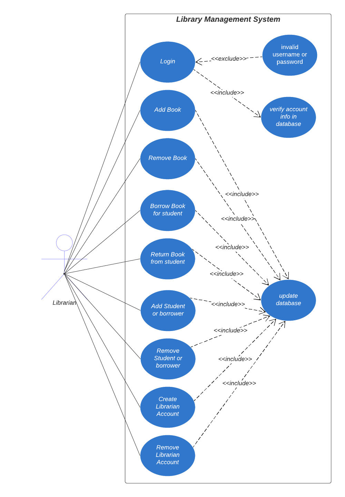
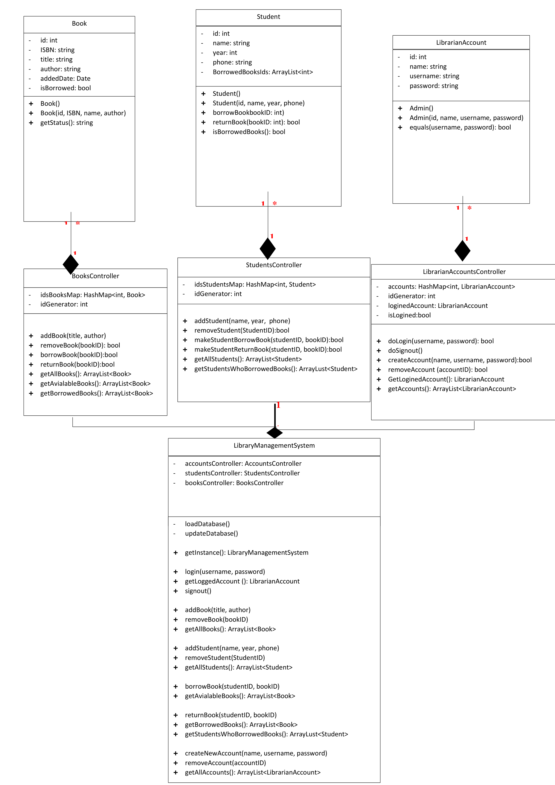
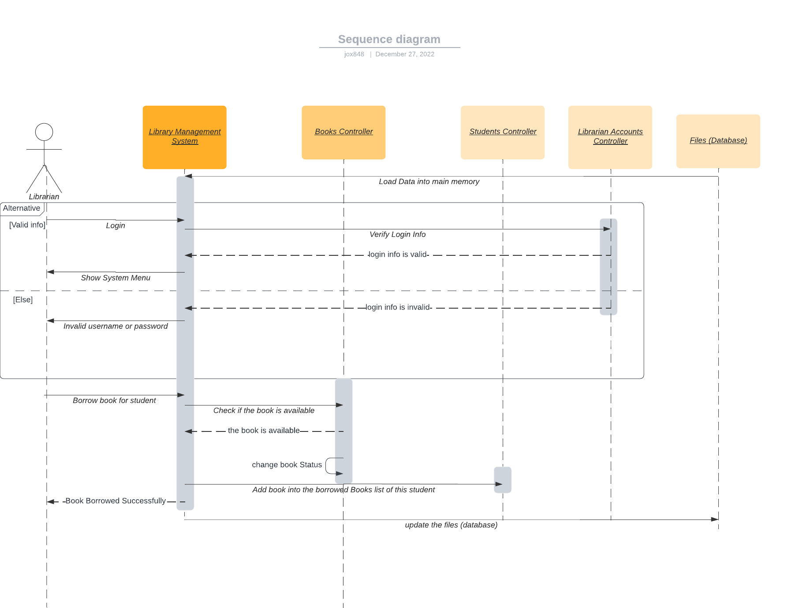

# Library Management System Desktop App
This is a Desktop Application helps library admin to manage books, user's, borrowing and returning processes.

# Build With
- Java

# UML Diagrams
- Use Case Diagram
  

- Class Diagram

- Sequence Diagram

